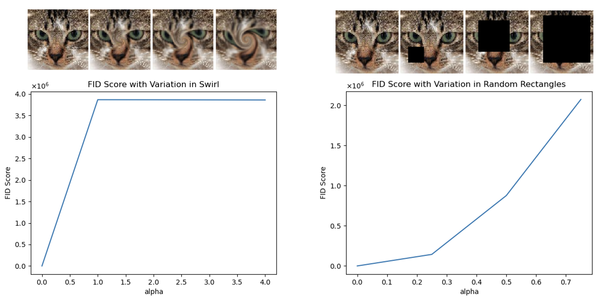

# PIC16B GAN Project

## Overview
Our project implements a deep convolutional adversarial network (DCGAN) using
the keras library. The DCGAN is made by creating a generator and discriminator
model. The generator takes a random noise vector and creates artificial images, while the discriminator acts as
a binary classifier during the training process to improve generators' performance. As the model trains, both the generator and discriminator
weights are updated as they approach an equilibrium. To aid the models in
reaching an equilibrium, each model was trained with a different learning
rate. Both the generator and discriminator were implemented using 4
convolutional layers. The code for our DCGAN can be seen in the `gan.py` file.
We trained our model on a
[cat dataset](https://www.kaggle.com/spandan2/cats-faces-64x64-for-generative-models)
containing 15.7k images. Training the
model took about 4 hours with 500 epochs.


## Training Results

 <br />
The above images are outputs from the generator after 500 epochs.

<br>

 <br />
The gif above shows our training process from epoch 5 to epoch 500. We could
see that the resulting images change from random noises to clear images of cats.
Around epoch 15, our images start to capture cats' features on eyes. Around
epoch 100, we could easily identify that the resulting images are cats. 

## Model Evaluation - FID Score
To evaluate our GAN model, we applied the Frechet Inception Distance (FID). FID 
was first proposed in the paper,
[Frechet Inception Distance as described in the GANs Trained by a Two Time-Scale Update RuleConverge to a Local Nash Equilibrium](https://arxiv.org/abs/1706.08500)
,as an improvement for Inception Score. According to the paper, the distributions 
of real data and generated data are assumed to follow a Gaussian distribution.
Hence, FID is a way of quantifying the difference between the two distributions.
To calculate FID score, we first used a pre-trained InceptionV3 network without 
the final output layer to extract features from both generated images and 
real-world images. The formula for FID calculation, proposed by the paper, 
is presented as follows, <br />
            <br />
where m denotes the feature-wise mean from  generated images; m_w denotes the
feature-wise mean from  real-world images; C and C_w are the covariance
matrices obtained by generated images and real-world images respectively. Lower
FID score indicates less difference between distributions generated images and 
that of real world images. 

### Exploring FID score on Training Data with Noise
Before we dive into the FID score for generated images, following the appendix
section on FID score of the paper mentioned above, we studied how FID score
changes if we add different types of random noise to our own training data. We
applied four types of random noise, Gaussian noise, Gaussian blur, Swirl, and
random rectangles. All types of random noise are applied with different noise
levels, indicated by alpha. Higher alpha values indicate higher noise level. We
applied 4 types of noise with different alpha values to all of our training
data, and calculate the FID score for each alpha value. We plot the change of
FID score versus alpha value for each noise type below. We can observe that in
general, FID score increases as we increase alpha, which indicates that the
distribution of data with higher noise level has a much higher difference from
the original data. Python code for noise functions can be found in
`noise_function.py`, and `test.py` implements `noise_function.py` on our training
data. 



FID is evaluated for upper left: Gaussian noise（choices of alpha: 0, 0.1, 0.25, 0.3, 0.4）\
upper right: Gaussian blur（choices of alpha: 0, 1, 3, 4）\
lower left: implanted black rectangles（choices of alpha: 0, 0.25, 0.5, 0.75）\
lower right: swirled images（choices of alpha: 0, 1, 2, 4）\
The disturbance level rises from zero and increases to the highest level. The FID captures the disturbance level very well by monotonically increasing.

### Frechet Inception Distance at Intervals of 10 Epochs
We want to explore how FID score improves throughout training. We saved the generator models to calculate FID scores every 10 epochs. Hence, we obtained the graph below, where we see a desirable decrease in FID score, meaning that our generated data got closer to the distribution of the training data. Throughout training, the lowest FID score we obtained was 466, and the FID score for our final model is 676.094.  <br />


## Interpolation
The graph below shows how our generator model reacts to different inputs. In 
our model we used an input vector containing 100 random variables initialized with a normal
distribution. From left to right, we can see how an incremental change in the
input vector changes
the generated output.
 <br />


## GAN Class
The GAN class is contained in the `gan.py` file. The following is a list of 
useful class methods.

- `load_model()` restores the last trained model

- `save_model()` saves the last trained model

- `train()` trains the model and outputs generated images every 5 epochs into
the `epochs` folder

- `summary()` outputs a summary of GAN model

- `plot_generated_images(filename)` plots a 4x4 grid of images generated by the
model at `filename`

- `FID(sample_size)` evaluates the current generator model with the frechet
inception distance score using a random sample of size `sample_size`


## Example Usage

The following examples demonstrate how to use the GAN class. 


### Load a Model
The `main.py` file demostrates how to load a previously trained GAN model
and output new images generated by the model.

```
from gan import GAN

# Load last trained model to skip training time
gan_model = GAN()
gan_model.load_model()
# save a 4x4 grid of images generated by the model
gan_model.plot_generated_images('generated_images')
# Prints the generator, discriminator, and GAN model summary
gan_model.summary()
```


### Train the Model
The `training.py` file demonstrates how to create a model with specified
hyperparameters. Every 5 epochs the model will output images will to `epochs`
to visualize trianing progress. The following code can take several hours to 
run.

```
from gan import GAN

# hyper parameters
BATCH_SIZE = 128
DISCRIMINATOR_LR = 5e-5
GENERATOR_LR = 2e-4
EPOCHS = 500
ALPHA = 5e-1


# training the model from scratch
gan_model = GAN()
# train the model wtih the given hyperparamters
gan_model.train(BATCH_SIZE, DISCRIMINATOR_LR, GENERATOR_LR, ALPHA, EPOCHS)
# save a 4x4 grid of images generated by the model
gan_model.plot_generated_images('generated_images')
# print a summary of the generator, discriminator, and GAN model
gan_model.summary()
# save model
gan_model.save_model()
```


## References

https://arxiv.org/abs/1706.08500

https://www.tensorflow.org/tutorials/generative/dcgan

https://www.kaggle.com/spandan2/cats-faces-64x64-for-generative-models

https://machinelearningmastery.com/how-to-implement-the-frechet-inception-distance-fid-from-scratch/

https://machinelearningmastery.com/how-to-develop-a-generative-adversarial-network-for-an-mnist-handwritten-digits-from-scratch-in-keras/
