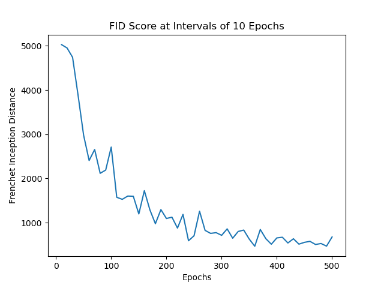
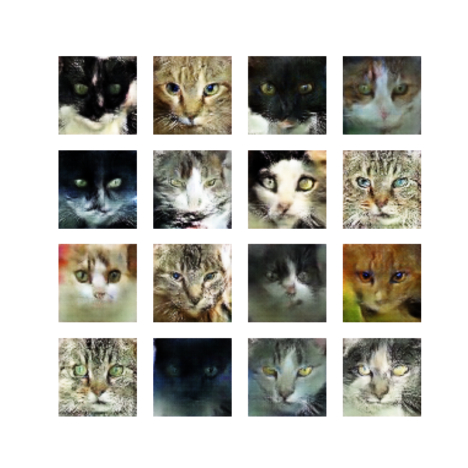

# PIC16B GAN Project

## Overview
Our project implements a deep convolutional adversarial network (DCGAN) using
the keras library. The DCGAN is made by creating a generator and discriminator
model. The generator creates artificial images while the discriminator acts as
a binary classifier. As the model trains, both the generator and discriminator
weights are updated as they approach an equilibrium. To aid the models in
reaching an equilibrium, each model was trained with a different learning
rate. Both the generator and discriminator were implemented using 4
convolutional layers. The code for our DCGAN can be seen in the `gan.py` file.
We trained our model on a
[cat dataset](https://www.kaggle.com/spandan2/cats-faces-64x64-for-generative-models)
containing 15.7k images. Training the
model took about 4 hours with 500 epochs.

To evaluate the model we used the
[Frechet Inception Distance as described in the GANs Trained by a Two Time-Scale Update RuleConverge to a Local Nash Equilibrium](https://arxiv.org/abs/1706.08500) paper. 
...

## Discussion
...

## Frechet Inception Distance


## Training Results


Generator output after 500 epochs


## GAN Class
The GAN class is contained in the `gan.py` file. The following is a list of 
useful class methods.

- `load_model()` restores the last trained model

- `save_model()` saves the last trained model

- `train()` trains the model and outputs generated images every 5 epochs into
the `epochs` folder

- `summary()` outputs a summary of GAN model

- `plot_generated_images(filename)` plots a 4x4 grid of images generated by the
model at `filename`

- `FID(sample_size)` evaluates the current generator model with the frechet
inception distance score using a random sample of size `sample_size`


## Example Usage

The following examples demonstrate how to use the GAN class. 


### Load a Model
The `main.py` file demostrates how to load a previously trained GAN model
and output new images generated by the model.

```
from gan import GAN

# Load last trained model to skip training time
gan_model = GAN()
gan_model.load_model()
# save a 4x4 grid of images generated by the model
gan_model.plot_generated_images('generated_images')
# Prints the generator, discriminator, and GAN model summary
gan_model.summary()
```


### Train the Model
The `training.py` file demonstrates how to create a model with specified
hyperparameters. Every 5 epochs the model will output images will to `epochs`
to visualize trianing progress. The following code can take several hours to 
run.

```
from gan import GAN

# hyper parameters
BATCH_SIZE = 128
DISCRIMINATOR_LR = 5e-5
GENERATOR_LR = 2e-4
EPOCHS = 500
ALPHA = 5e-1


# training the model from scratch
gan_model = GAN()
# train the model wtih the given hyperparamters
gan_model.train(BATCH_SIZE, DISCRIMINATOR_LR, GENERATOR_LR, ALPHA, EPOCHS)
# save a 4x4 grid of images generated by the model
gan_model.plot_generated_images('generated_images')
# print a summary of the generator, discriminator, and GAN model
gan_model.summary()
# save model
gan_model.save_model()
```


## References

https://arxiv.org/abs/1706.08500

https://www.tensorflow.org/tutorials/generative/dcgan

https://www.kaggle.com/spandan2/cats-faces-64x64-for-generative-models

https://machinelearningmastery.com/how-to-implement-the-frechet-inception-distance-fid-from-scratch/

https://machinelearningmastery.com/how-to-develop-a-generative-adversarial-network-for-an-mnist-handwritten-digits-from-scratch-in-keras/
